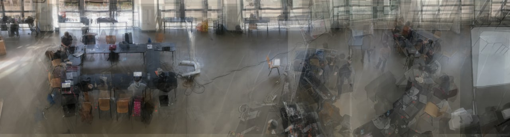

### Problemstellung:

Wie wird das Studio genutzt und welchen Raum nehmen die dort durchgeführten Aktionen ein. (Aktionsraum)
Können diese parallel passieren, wie bedingen diese sich gegenseitig?

Definition Aktionsraum: 
Ein Bereich in unserem Studio, der für eine bestimmte Zeit für eine bestimmte Aktivität genutzt wird.

 
### Versuchsaufbau:

Dokumentation des Studios und der durchgeführten Aktionen:
- _Photographisch_: Stativ auf Empore, Kamera, Intervall von 2h 
- *Zeichnerisch*: Einzeichnen in Grundrisse

### Durchführung:

Photographischen Dokumentation:
- Studio ist zu groß um mit einem Bild abgebildet zu werden
- Anstelle von Kamera auf Stativ 
	-> Panorama entlang der Empore mit dem Handy

**Zeitraum**: Donnerstag, der 03.11.22 -> Dienstag, den 08.11.22.

**Aufnahme Intervall**: mehrmals am Tag und wenn sich Situationen deutlich geändert haben

Zeichnerische Dokumentation: Eintragen der Aktionsräume in den Grundriss (Illustrator), mehrmals am Tag und wenn sich Situationen deutlich geändert haben.

### Auswertung/Deutung:

Um die zeitliche Gleichzeitigkeit zu simulieren, alle Dokumentationen als übereinander gelagerte Layer.
Um die Veränderung der Aktionsräume über die Beobachtungszeit in einem Bild darzustellen, werden die Panorama Aufnahmen übereinander gelegt.

Das gleiche haben wir mit unseren Skizzen gemacht

Vergleich von Skizzen und Fotos
- Im linke Teil ändert sich die Nutzung aber nicht die physische Raumsituation
- Der rechte Teil ist sehr dynamisch und besitzt eine hohe Dichte an verschiedenen Raumaktivitäten

Deutung:

In Bezug auf die Startsituation im Raum befanden sich schon Tische und Stühle in einer geschlossenen U-Aufstellung im linken Teil des Studios. Diese Aufstellung hat sich im Verlauf der Beobachtung nicht verändert und wurde für verschiedenste Aktionen benutzt.
Im rechten Teil war keine Ursprüngliche Anordnung und die Aktionen haben sich frei im Raum angesiedelt.

Interessant, wenn man eine bestimmte Raumaktivität forcieren will. lohnt es sich Mobiliar in einer geordneten Formation zu stellen.
Die Manipulation der Aktionsräume beschränkt sich dabei nur auf ihre physische Situation im Raum, nicht auf die Art der Aktivität.