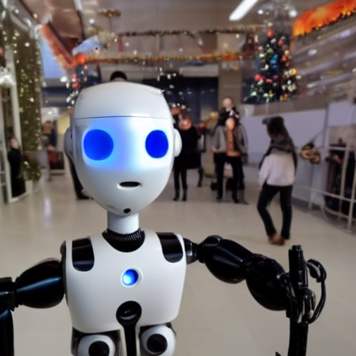

Today, we brainstormed a bunch of fun ideas.

First, we wanted to define the term *augmentation* in order to clarify our expectations and possibilities for the new situation. Augmentation, amongst the official definition of making things greater, means for us:
- going beyond the obvious
- generating knowledge that didn't exist before
- augmenting in various senses: virtual, real, psychological, mental, informational

Our "Before" Selfie:

After defining the term *augmentation* for ourselves, we came up with three ideas for digital, virtual, and interdisciplinary augmentation in our studio:

**1. Seek&Find**

*Background*: The process of searching and finding is a versatile, mostly unintentional and yet effective way to explore a space. The process is an action that probably everyone knows (mostly disliked) and realizes: one usually finds and discovers things on the way to the object we are looking for, which we were not looking for in the beginning. Nevertheless, those things stay in our minds and bring the space and room (in every sense) closer to our perception.

*Concrete*: ***DesireQuest*** - Make a wish! We create a room for wishes. You get what you want, but you have to find it first. By means of text-to-3D (DreamFusion) the desired objects are created and located in the room. Augmented Reality glasses (e.g. magic leap) are used not only for seeking (which might be done in a pot-beating style), but also for discovering and exploring. A game between reality and virtuality, between the existing space of the studio combined with augmented objects.

DesireQuest: Your friendly virtual robot giving presents to human slaves

Reference Projects
[Magic3D](https://deepimagination.cc/Magic3D/)
[DreamFusion](https://dreamfusion3d.github.io)

[implicit shape generation](https://github.com/liuzhengzhe/Towards-Implicit-Text-Guided-Shape-Generation)

[Latent NeRF](https://github.com/eladrich/latent-nerf)

Idea: Use sketchfab API to scan for existing models first, then generate one
[Sketchfab API](https://sketchfab.com/developers/download-api)

Hardware:
[Magic Leap One](https://www.magicleap.com/ml1-devices)

Software:

[Unity with AR Backbone](https://docs.unity3d.com/Manual/AROverview.html)

Our Unity Project:
TODO

Our fork of stable-dreamfusion:
- has better gradio GUI than original, content not changed
[arontaupe/stable-dreamfusion](https://github.com/arontaupe/stable-dreamfusion)

(Unity with AR Backbone)[https://docs.unity3d.com/Manual/AROverview.html]

**2. Room Characters**

*Background*: as we already learned in the second session of 'Raum als Interface', definitions of a room can be multifaceted and are not only limited to spatial extention. We know that spaces are also created by their temporal component and their utilisation szenarios, and thus the actors of a room also define the respective space. However, what if it is not the actors that create the space, but the space that creates the actors? The space might also have a personality that interacts with the people and wants to get to know their inhabitants. For this scenario, various narratives must be developed that the space can indirectly take. In order to form the character of the space, we must first create it, or the other way around?!?

*Concrete*: ***HelloRoom*** - who are you? We develop a possible character of the room that interacts with its individuals. Through various augmentations of psychological, virtual and abstract nature, the room can ask questions, find answers and find out things about its users. Can the character of the space be further developed through these encounters? What does the space know about us that we ourselves did not know before?

**3. Gossip Glasses**

*Background*: the Internet, as one of the most used and at the same time most controversial forms of augmentation knows things that we ourselves do not know. In times of Twitter, Instagram, and Co, there is a lot of data about us on the net, which can be found just via successful research.

*Concrete*: The ***Gossip-glasses*** recognize emotions and find backgrounds. They are dangerous and scary, but still addictive. A critical reflection of information technology augmentations in the form of thought-reading needs to be performed.

![https://github.com/arontaupe/stable-dreamfusion/blob/959f66de5a8b66486dcb7f0db3acb1dcfeb91c35/wedding_cake/results/df_ep0000_rgb.mp4]
