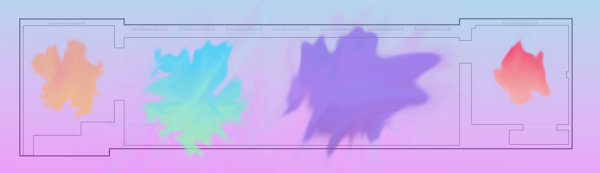

-DE-
Was macht einen Raum aus? Wie entstehen Stimmungen und Atmosphären? Können wir diese visualisieren, um die Erfahrung sichtbar zu machen?
Das Projekt "Das Wesen der Dinge" zielt darauf ab, die Wahrnehmung zu erweitern (augmentieren) indem die Stimmungen der Orte durch die Auren der Objekte im Raum erfahrbar gemacht werden. Was macht Objekte zu Subjekten? Wie können wir Implizites explizit machen? Und wie können wir den Charakter eines Ortes sichtbar machen?
Wir hinterfragen den konservativen, rein-physischen Raumbegriffs und adressieren im Projekt eine zeitliche, geschichtliche Komponente des Raums, seiner Bestandteile und seiner Vergangenheit.
Der Raum wird sich transformiert haben: von einem einfachen „Gegenstand, auf den das Interesse, das Denken, das Handeln gerichtet ist“ (Definition Objekt Duden), zu einem „mit Bewusstsein ausgestatteten, denkenden, erkennenden, handelnden Wesen“ (Definition Subjekt Duden). Diese Metamorphose der Subjektbildung, kann der Raum nur dann durchlaufen, wenn eine Einwirkung – ja, genauer gesagt eine Formung, Umformung, Verformung, Deformierung - den Anfangszustand des Raums prägend beeinflusst und der Raum schließlich anders wahrgenommen wird.

-EN-
What makes a room? How do moods and atmospheres emerge? Can we visualize them to make the experiences visible?
The project "The Nature of Objects" aims to expand (augment) perception by making the moods of places tangible through the respective auras of the objects in the space. What makes objects subjects? How can we make the implicit explicit? And how can we make the character of a place visible?
Here, we question the conservative, purely physical concept of space and address in the project a temporal, historical component of space, its objects and their past.
Space will have transformed: from a simple "object on which interest, thought, action is directed" (definition object Duden), to a "creature that is endowed with consciousness, thinking, sensing, acting" (definition subject Duden). This metamorphosis of subject formation, the space can only undergo if an influence - yes, more precisely a shaping, reshaping, deformation - has a formative influence on the initial state of the space and the space can finally be perceived differently.

**User-Experience:**  
Step 1: Einnehmen der Aura-Pille  
Step 2: Aufsetzen der Aura-Brille oder Starten der Aura-App  
Step 3: Beobachten der verschiedenen Auren des Raums und dessen Objekte  
Step 4: Beeinflussen der verschiedenen Auren durch Aktionen

