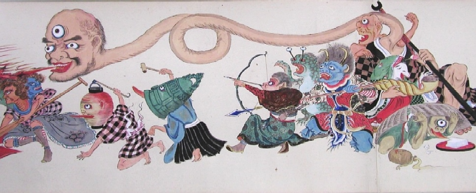

Technische Updates:
- Image tracking mit Unity & MagicLeap möglich
- Object detection und tracking schwer zu implementieren
- Idee der Gestaltung von Stickern, die die Objekte personalisieren und trackbar machen
- Erste 'Auren' in Unity erstellt (mittels Particle Systems)

Weiteres Vorgehen:
- Mögliche Objekte, die getrackt werden sollen (Stuhl, Eurobox, Fensterscheibe, Türklinke, Uhr, Bildschirm, Tisch, Schalter, Computer, Heizung, Piktogramme, Pylonen, Lautsprecher, Kaffeetasse, Person, Tasche)
- Mögliche Variablen, die Auren verändern können (Helligkeit, Lautstärke, Distanz, Berührung, Farbe, Wärme, Liebe, Unruhe (durch Bewegung), Clutteryness)
- Verbindung von Objekten und ihren Variablen (Sticker gestalten, Particlesystem erstellen, erste Objekte personalisieren)
- Optional: Sounds hinzufügen, mögliche Interaktionen erweitern

Besprechung mit Johannes & Franz:
- Referenzen zu:
    - Tsukumogami, japanische 'Artefakt-Geister' die Gegenstände aus dem Alltag beseelen
    - [Aurabegriff](https://de.wikipedia.org/wiki/Aura_(Benjamin)) nach Walter Benjamin in seinem Aufsatz „Das Kunstwerk im Zeitalter seiner technischen Reproduzierbarkeit“
- Fokus auf die konzeptionelle Strategie, weniger auf technische Möglichkeiten fokussieren
- Frage, ob nur auf der Brille, oder auch auf dem Handy möglich?

(https://www.etsy.com/ch/listing/945187346/tsukumogami)
(https://japon-secreto.com/tag/tsukumogami/)
