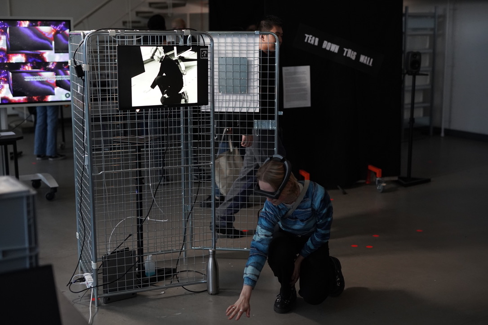

→ Finale Präsentation von Situation 2 

→ Vorbereitung um Umsetzung:
- Käfigpräparation (Erfahrung als 'freilassen' performativ erkunden)
- Einsatz einer mehrfarbigen Glühbirne (Konnotation des Lichts) 
- Videoinstallation (als Anschauung für Dritte, Gebrauchsanweisung, Inspiration)
- Einladung als Poster am Käfig (Erklärung der Interaktion, dem Erkundungscharakter)

